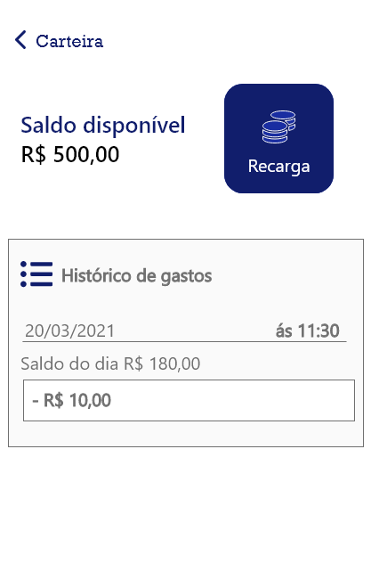

# RUSH TO WIN 
#
#### Rush to Win é um app desenvolvido em flutter com o objetivo de ser um Mobility as a Service (MaaS). A principal funcionalidade dele é facilitar o pagamento no transporte público. Foi desenvolvido apenas para o meio acadêmico.


#





#
## Instruções

   
1. [Clonar a API desenvolvida para o App (seguir as instruções no README.md)](https://github.com/gabrielcoronin/rushtowin-api.git)

2. ``` git clone  https://github.com/gabrielcoronin/rushtowin.git``` 
   
3. Garantir que o computador tenha o ambiente flutter configurado -
[como configurar o ambiente Flutter](https://www.treinaweb.com.br/blog/configurando-ambiente-de-desenvolvimento-flutter) 

4. Abrir o código na sua IDE favorita

5. Entrar nos arquivos transaction e user webclients e trocar o host pelo seu respectivo ip - [como verificar o ip](https://www.techtudo.com.br/dicas-e-tutoriais/noticia/2014/03/como-descobrir-o-ip-interno-e-externo-do-seu-computador-entenda.html) 

6. Rodar o app simultaneamente com a API.


